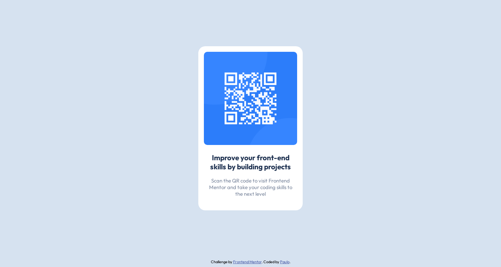

# Frontend Mentor - QR code component solution

This is a solution to the [QR code component challenge on Frontend Mentor](https://www.frontendmentor.io/challenges/qr-code-component-iux_sIO_H).

## Table of contents

- [Overview](#overview)
  - [Screenshot](#screenshot)
  - [Links](#links)
- [My process](#my-process)
  - [Built with](#built-with)
- [Author](#author)

## Overview

### Screenshots

### Links

- Solution URL: [https://www.frontendmentor.io/solutions/qr-code-component-using-html-and-css-with-flexbox-rJa8yks4q](https://www.frontendmentor.io/solutions/qr-code-component-using-html-and-css-with-flexbox-rJa8yks4q)
- Live Site URL: [https://qr-code-component-wellspr.vercel.app/](https://qr-code-component-wellspr.vercel.app/)

## My process

### Built with

- Semantic HTML5 markup
- CSS custom properties
- Flexbox
- Mobile-first workflow

## Author

- Frontend Mentor - [@wellspr](https://www.frontendmentor.io/profile/wellspr)
- Twitter - [@paulowells](https://www.twitter.com/paulowells)
